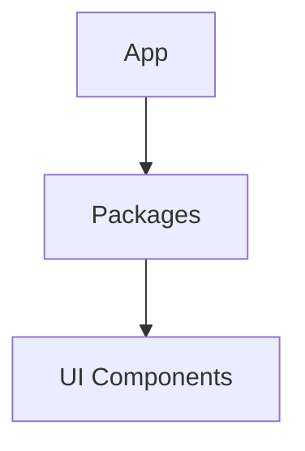

# Architecture Documentation

System design decisions, technical choices, and architectural patterns for this monorepo.

---

## Purpose

Document the **"why"** behind architectural decisions:

- Why did we choose this technology?
- Why did we structure code this way?
- What tradeoffs did we consider?
- What alternatives did we reject?

---

## Structure

```
architecture/
├── README.md                          ← You are here
├── decisions/                         ← ADRs (Architecture Decision Records)
│   ├── 001-monorepo-structure.md
│   ├── 002-state-management.md
│   └── ...
├── patterns/                          ← Common patterns and conventions
│   ├── component-patterns.md
│   ├── data-flow.md
│   └── ...
└── diagrams/                          ← Visual representations
    ├── system-overview.md
    └── ...
```

---

## Architecture Decision Records (ADRs)

### Format

```markdown
# ADR-NNN: Title

**Status:** Proposed | Accepted | Deprecated | Superseded by ADR-XXX
**Date:** YYYY-MM-DD
**Deciders:** @username, @username

## Context

What is the issue we're facing?

## Decision

What did we decide?

## Consequences

What are the results (good and bad)?

## Alternatives Considered

What else did we evaluate?
```

### Naming Convention

- Format: `NNN-kebab-case-title.md`
- Numbers: Zero-padded (001, 002, 003)
- Sequential: Always increment

### When to Write an ADR

- Technology choice (frameworks, libraries)
- Major architectural patterns
- Cross-cutting concerns (auth, routing, state)
- Significant refactors
- Breaking changes

---

## Current Architecture

### Monorepo Structure

- **Turborepo** for build orchestration and caching
- **PNPM workspaces** for package management
- **Apps** are independently deployable
- **Packages** are shared internal dependencies

### Frontend Architecture

- **React 19** with hooks and modern patterns
- **TanStack Router** for type-safe routing
- **Zustand** for lightweight state management
- **Convex** for backend and real-time data
- **Tailwind CSS v4** for styling

### Code Organization

- **Feature-based** structure in apps
- **Shared components** in packages
- **Barrel exports** (`index.ts`) for clean imports
- **Path aliases** (`@/`) for cross-directory imports

### Type Safety

- **Strict TypeScript** with no escape hatches
- **End-to-end types** from database to UI
- **Validated at build time** - no runtime surprises

---

## Key Principles

1. **Monorepo benefits without monorepo complexity**
   - Simple workspace structure
   - Clear boundaries between apps and packages
   - Easy to add new apps/packages

2. **Type safety everywhere**
   - TypeScript strict mode
   - No `any`, no `@ts-ignore`
   - Compile-time validation

3. **Fast feedback loops**
   - Hot module reload in development
   - Turborepo caching for builds
   - Pre-commit hooks catch issues early

4. **Modern, minimal dependencies**
   - Prefer platform APIs over libraries
   - Choose well-maintained, stable packages
   - Avoid framework lock-in where possible

5. **Developer experience first**
   - Clear error messages
   - Consistent tooling
   - Fast builds and tests
   - Comprehensive documentation

---

## Adding New Architecture Docs

### For Decisions

Create an ADR in `decisions/` following the format above.

### For Patterns

Document common patterns in `patterns/` with examples:

- Component composition
- State management approaches
- Error handling strategies
- Testing patterns

### For Diagrams

Use Mermaid markdown for system diagrams:



---

## Questions?

If architecture is unclear or inconsistent, either:

1. **Document it** - add an ADR or pattern doc
2. **Discuss it** - raise in session handover
3. **Fix it** - refactor to align with principles

**Architecture should be obvious, not clever.**
