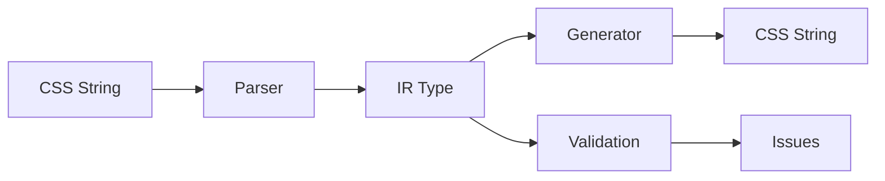

# 🏗️ CSS Property Creation Handbook

_A comprehensive, agent-friendly guide for implementing new CSS properties in the b_values system_

## 📋 Table of Contents

1. [Overview](#overview)
2. [Architecture Patterns](#architecture-patterns)
3. [Property Creation Checklist](#property-creation-checklist)
4. [Single-Value Properties](#single-value-properties)
5. [Multi-Value Properties](#multi-value-properties)
6. [Testing Patterns](#testing-patterns)
7. [Integration Steps](#integration-steps)
8. [Common Patterns & Best Practices](#common-patterns--best-practices)

---

## Overview

The b_values system follows a **modular, type-safe architecture** with clear separation of concerns:

```
📦 b_declarations     ← Property definitions & orchestration
├── 📦 b_types        ← Zod schemas & IR types
├── 📦 b_parsers      ← CSS → IR conversion
├── 📦 b_generators   ← IR → CSS conversion
├── 📦 b_keywords     ← Reusable keyword schemas
└── 📦 b_units        ← Unit type definitions
```

**Key Principles:**

- ✅ **Type Safety**: Zod schemas validate all data
- ✅ **Resilient Parsing**: Graceful error handling with detailed issues
- ✅ **Separation**: Parser/Generator logic isolated from property definitions
- ✅ **Reusability**: Shared components across properties
- ✅ **Testability**: Comprehensive test coverage expected

---

## Architecture Patterns

### 🔄 Data Flow



### 📁 File Structure Pattern

Each property follows this **exact structure**:

```
packages/b_declarations/src/properties/{property-name}/
├── index.ts          ← Re-exports all modules
├── definition.ts     ← defineProperty() call + metadata
├── types.ts          ← Zod schemas & TypeScript types
├── parser.ts         ← CSS → IR parsing logic
├── generator.ts      ← IR → CSS generation logic
├── parser.test.ts    ← Parser test suite
└── generator.test.ts ← Generator test suite
```

---

## Property Creation Checklist

### 🎯 Pre-Implementation Analysis

- [ ] **Identify property type**: Single-value vs Multi-value (comma-separated)
- [ ] **Study CSS specification**: Understand syntax, keywords, initial values
- [ ] **Analyze existing types**: Check if needed types exist in b_types/b_keywords/b_units
- [ ] **Review similar properties**: Find patterns to follow

### 📝 Implementation Steps

#### Step 1: Create Directory Structure

```bash
mkdir packages/b_declarations/src/properties/{property-name}
```

#### Step 2: Define Types (`types.ts`)

- [ ] Create Zod schema for IR representation
- [ ] Export TypeScript type using `z.infer`
- [ ] Handle keywords (CSS-wide + property-specific)
- [ ] Use discriminated unions for complex types

#### Step 3: Implement Parser (`parser.ts`)

- [ ] Choose single-value vs multi-value parser
- [ ] Import required parsing utilities
- [ ] Handle error cases gracefully
- [ ] Return proper ParseResult with issues

#### Step 4: Implement Generator (`generator.ts`)

- [ ] Handle all IR variants (keywords, lists, etc.)
- [ ] Return proper GenerateResult with issues
- [ ] Include property name in result
- [ ] Maintain path context for nested structures

#### Step 5: Create Definition (`definition.ts`)

- [ ] Call `defineProperty<YourIRType>`
- [ ] Set all required metadata (name, syntax, inherited, initial)
- [ ] Choose multiValue flag correctly
- [ ] Register parser and generator

#### Step 6: Create Index (`index.ts`)

- [ ] Re-export all modules

#### Step 7: Write Tests

- [ ] Comprehensive parser tests (success + error cases)
- [ ] Comprehensive generator tests
- [ ] Round-trip tests for complex cases

#### Step 8: Update Type Maps

- [ ] Add property to `types.map.ts`
- [ ] Update exports in `properties/index.ts`

#### Step 9: Integration

- [ ] Import in `b_declarations/src/index.ts` if needed
- [ ] Run tests: `just test`
- [ ] Run quality checks: `just check`

---

## Single-Value Properties

### 🎯 When to Use

Properties that accept **one value at a time**:

- `color: red`
- `width: 100px`
- `opacity: 0.5`

### 📋 Template

**types.ts:**

```typescript
import { z } from "zod";
import * as Keywords from "@b/keywords";
import { colorSchema } from "@b/types"; // Import needed types

export const myPropertyIR = z.discriminatedUnion("kind", [
  // CSS-wide keywords
  z.object({
    kind: z.literal("keyword"),
    value: Keywords.cssWide,
  }),
  // Property-specific value
  z.object({
    kind: z.literal("color"),
    value: colorSchema,
  }),
]);

export type MyPropertyIR = z.infer<typeof myPropertyIR>;
```

**parser.ts:**

```typescript
import { type ParseResult } from "@b/types";
import * as Parsers from "@b/parsers";
import type { MyPropertyIR } from "./types";
import type * as csstree from "@eslint/css-tree";

// Single-value parser receives AST node directly
export function parseMyProperty(node: csstree.Value): ParseResult<MyPropertyIR> {
  // Parse using existing parsers
  const colorResult = Parsers.Color.parseColor(node);
  if (colorResult.ok) {
    return {
      ok: true,
      value: { kind: "color", value: colorResult.value },
      issues: colorResult.issues,
    };
  }

  // Fallback with collected issues
  return {
    ok: false,
    value: undefined,
    issues: colorResult.issues,
  };
}
```

**generator.ts:**

```typescript
import type { GenerateResult } from "@b/types";
import * as Generators from "@b/generators";
import type { MyPropertyIR } from "./types";

export function generateMyProperty(ir: MyPropertyIR): GenerateResult {
  if (ir.kind === "keyword") {
    return {
      ok: true,
      value: ir.value,
      property: "my-property",
      issues: [],
    };
  }

  if (ir.kind === "color") {
    return Generators.Color.generateColor(ir.value);
  }

  return {
    ok: false,
    value: undefined,
    property: "my-property",
    issues: [createError("invalid-ir", "Unknown IR structure")],
  };
}
```

**definition.ts:**

```typescript
import { defineProperty } from "../../core";
import { parseMyProperty } from "./parser";
import { generateMyProperty } from "./generator";
import type { MyPropertyIR } from "./types";

export const myProperty = defineProperty<MyPropertyIR>({
  name: "my-property",
  syntax: "<color>",
  parser: parseMyProperty, // SingleValueParser
  multiValue: false, // ← Key: Single-value
  generator: generateMyProperty,
  inherited: false,
  initial: "transparent",
});
```

---

## Multi-Value Properties

### 🎯 When to Use

Properties that accept **comma-separated lists**:

- `background-image: url(a.png), url(b.png)`
- `font-family: Arial, sans-serif`
- `background-size: 100px 200px, cover`

### 📋 Template

**types.ts:**

```typescript
import { z } from "zod";
import * as Keywords from "@b/keywords";
import { imageSchema } from "@b/types";

export const myMultiPropertyIR = z.discriminatedUnion("kind", [
  // Property-specific keywords (e.g., "none")
  z.object({
    kind: z.literal("keyword"),
    value: z.union([Keywords.cssWide, Keywords.none]),
  }),
  // List of values
  z.object({
    kind: z.literal("list"),
    values: z.array(imageSchema).min(1),
  }),
]);

export type MyMultiPropertyIR = z.infer<typeof myMultiPropertyIR>;
```

**parser.ts:**

```typescript
import { parseOk, type ParseResult } from "@b/types";
import * as Parsers from "@b/parsers";
import { createMultiValueParser } from "../../utils";
import type { MyMultiPropertyIR } from "./types";
import type { Image } from "@b/types";
import type * as csstree from "@eslint/css-tree";

// Multi-value parser receives raw string
export const parseMyMultiProperty = createMultiValueParser<Image, MyMultiPropertyIR>({
  // Handle property-specific keywords BEFORE list parsing
  preParse: (value: string): ParseResult<MyMultiPropertyIR> | null => {
    if (value.trim().toLowerCase() === "none") {
      return parseOk({ kind: "keyword", value: "none" });
    }
    return null; // Continue to list parsing
  },

  // Parse each item in the comma-separated list
  itemParser(valueNode: csstree.Value): ParseResult<Image> {
    return Parsers.Image.parseImageValue(valueNode);
  },

  // Aggregate successful items into final IR
  aggregator(images: Image[]): MyMultiPropertyIR {
    return { kind: "list", values: images };
  },
});
```

**generator.ts:**

```typescript
import type { Issue, GenerateResult } from "@b/types";
import * as Generators from "@b/generators";
import type { MyMultiPropertyIR } from "./types";

export function generateMyMultiProperty(ir: MyMultiPropertyIR): GenerateResult {
  if (ir.kind === "keyword") {
    return {
      ok: true,
      value: ir.value,
      property: "my-multi-property",
      issues: [],
    };
  }

  // Generate each item
  const results: string[] = [];
  const allIssues: Issue[] = [];

  for (let i = 0; i < ir.values.length; i++) {
    const result = Generators.Image.generateImageValue(ir.values[i], ["values", i]);
    if (!result.ok) {
      return result; // Early exit on failure
    }
    results.push(result.value);
    allIssues.push(...result.issues);
  }

  return {
    ok: true,
    value: results.join(", "),
    property: "my-multi-property",
    issues: allIssues,
  };
}
```

**definition.ts:**

```typescript
import { defineProperty } from "../../core";
import { parseMyMultiProperty } from "./parser";
import { generateMyMultiProperty } from "./generator";
import type { MyMultiPropertyIR } from "./types";

export const myMultiProperty = defineProperty<MyMultiPropertyIR>({
  name: "my-multi-property",
  syntax: "<image>#",
  parser: parseMyMultiProperty, // MultiValueParser
  multiValue: true, // ← Key: Multi-value
  generator: generateMyMultiProperty,
  inherited: false,
  initial: "none",
});
```

---

## Testing Patterns

### 🧪 Parser Tests

**Structure:**

```typescript
describe("parseMyProperty", () => {
  describe("valid values", () => {
    it("should parse color keywords", () => {
      const result = parseMyProperty(parseValueNode("red"));
      expect(result.ok).toBe(true);
      if (!result.ok) return;
      expect(result.value.kind).toBe("color");
    });
  });

  describe("invalid values", () => {
    it("should reject invalid input", () => {
      const result = parseMyProperty(parseValueNode("invalid"));
      expect(result.ok).toBe(false);
      expect(result.issues[0]?.code).toBe("invalid-value");
    });
  });

  describe("edge cases", () => {
    // Test boundary conditions
  });
});
```

### 🧪 Generator Tests

**Structure:**

```typescript
describe("generateMyProperty", () => {
  it("should generate CSS from IR", () => {
    const ir: MyPropertyIR = { kind: "color", value: { kind: "named", value: "red" } };
    const result = generateMyProperty(ir);
    expect(result.ok).toBe(true);
    if (!result.ok) return;
    expect(result.value).toBe("red");
  });
});
```

### 🧪 Multi-Value Tests

**Additional patterns for multi-value:**

```typescript
describe("parseMyMultiProperty", () => {
  describe("multi-value parsing", () => {
    it("should parse comma-separated list", () => {
      const result = parseMyMultiProperty("url(a.png), url(b.png)");
      expect(result.ok).toBe(true);
      if (!result.ok) return;
      expect(result.value.kind).toBe("list");
      expect(result.value.values).toHaveLength(2);
    });

    it("should handle partial failures gracefully", () => {
      const result = parseMyMultiProperty("url(valid.png), invalid");
      expect(result.ok).toBe(false); // Has issues
      expect(result.value?.kind).toBe("list");
      expect(result.value?.values).toHaveLength(1); // One valid item
    });
  });
});
```

---

## Integration Steps

### 1️⃣ Type Map Registration

**Add to `types.map.ts`:**

```typescript
export interface PropertyIRMap {
  // ... existing properties
  "my-property": MyPropertyIR;
  "my-multi-property": MyMultiPropertyIR;
}
```

### 2️⃣ Export Registration

**Add to `properties/index.ts`:**

```typescript
export * from "./my-property";
export * from "./my-multi-property";
```

### 3️⃣ Parser/Generator Dependencies

**Check if you need new parsers/generators in b_parsers/b_generators:**

**b_parsers patterns:**

- Individual functions for specific types
- Utility functions for common patterns
- AST node processing utilities

**b_generators patterns:**

- Mirror parser structure
- Handle path context for nested errors
- Graceful error aggregation

---

## Common Patterns & Best Practices

### 🎨 IR Design Patterns

#### **Discriminated Unions**

✅ **Always use discriminated unions for IR types:**

```typescript
z.discriminatedUnion("kind", [
  z.object({ kind: z.literal("keyword"), value: Keywords.cssWide }),
  z.object({ kind: z.literal("list"), values: z.array(itemSchema) }),
]);
```

#### **Keyword Handling**

✅ **Separate CSS-wide from property-specific keywords:**

```typescript
// CSS-wide: inherit, initial, unset, revert, revert-layer
value: Keywords.cssWide,

// Property-specific: none, auto, etc.
value: z.union([Keywords.cssWide, Keywords.none]),
```

### 🔧 Parser Patterns

#### **Error Accumulation**

✅ **Try multiple parsers and accumulate issues:**

```typescript
const colorResult = Parsers.Color.parseColor(node);
const keywordResult = Parsers.Utils.parseKeyword(node);

const allIssues = [...colorResult.issues, ...keywordResult.issues];
```

#### **Early Returns**

✅ **Return early on successful parse:**

```typescript
const result = Parsers.Color.parseColor(node);
if (result.ok) {
  return parseOk({ kind: "color", value: result.value });
}
```

### 🏭 Generator Patterns

#### **Path Context**

✅ **Maintain path for nested error reporting:**

```typescript
const result = Generators.Color.generateColor(ir.value, [...parentPath, "color"]);
```

#### **Issue Aggregation**

✅ **Collect all issues before returning:**

```typescript
const allIssues: Issue[] = [];
for (const item of items) {
  const result = generateItem(item);
  allIssues.push(...result.issues);
}
```

### 🧪 Testing Patterns

#### **Comprehensive Coverage**

✅ **Test all code paths:**

- Valid inputs (happy path)
- Invalid inputs (error cases)
- Edge cases (empty, boundary values)
- Multi-value scenarios (if applicable)

#### **Round-trip Testing**

✅ **Ensure parse → generate consistency:**

```typescript
const originalCSS = "red, blue, green";
const parsed = parseProperty(originalCSS);
const generated = generateProperty(parsed.value);
expect(generated.value).toBe(originalCSS);
```

### ⚡ Performance Patterns

#### **Parser Ordering**

✅ **Order parsers by likelihood of success:**

```typescript
// Try most common cases first
const namedColorResult = parseNamedColor(node);
if (namedColorResult.ok) return namedColorResult;

const hexColorResult = parseHexColor(node);
if (hexColorResult.ok) return hexColorResult;
```

#### **Early Validation**

✅ **Validate before expensive parsing:**

```typescript
// Quick string check before AST parsing
if (!value.includes("url(")) {
  return parseErr("image", createError("invalid-syntax", "Expected image"));
}
```

---

## 🚨 Common Gotchas

### ❌ Don't Do This

1. **Missing multiValue flag**

   ```typescript
   // Wrong - will receive AST node instead of string
   parser: parseMultiValueProperty,
   // Missing: multiValue: true,
   ```

2. **CSS-wide keyword duplication**

   ```typescript
   // Wrong - CSS-wide keywords handled by orchestrator
   preParse: (value) => {
     if (value === "inherit") return parseOk(...); // ❌ Don't do this
   }
   ```

3. **Incomplete error handling**

   ```typescript
   // Wrong - missing issue propagation
   if (result.ok) {
     return parseOk(result.value);
   }
   return parseErr("property", createError("generic", "Failed")); // ❌ Lost specific issues
   ```

### ✅ Do This Instead

1. **Correct multiValue setup**

   ```typescript
   parser: parseMultiValueProperty,
   multiValue: true, // ✅ Explicitly set
   ```

2. **Property-specific keywords only**

   ```typescript
   preParse: (value) => {
     if (value === "none") return parseOk({ kind: "keyword", value: "none" }); // ✅ Property-specific
     return null; // ✅ Let orchestrator handle CSS-wide
   };
   ```

3. **Issue propagation**

   ```typescript
   if (result.ok) {
     return parseOk({ kind: "color", value: result.value });
   }
   return {
     // ✅ Preserve all issues
     ok: false,
     value: undefined,
     issues: result.issues,
   };
   ```

---

## 📚 Reference Examples

### 🔍 Study These Properties

**Simple single-value:**

- `packages/b_declarations/src/properties/background-attachment`

**Complex multi-value:**

- `packages/b_declarations/src/properties/background-image`

**Keyword-heavy:**

- `packages/b_declarations/src/properties/background-clip`

**Custom handling:**

- `packages/b_declarations/src/properties/custom-property`

---

_This handbook provides the complete methodology for implementing CSS properties in the b_values system. Follow these patterns exactly for consistency and reliability._
